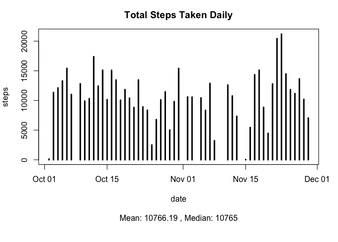
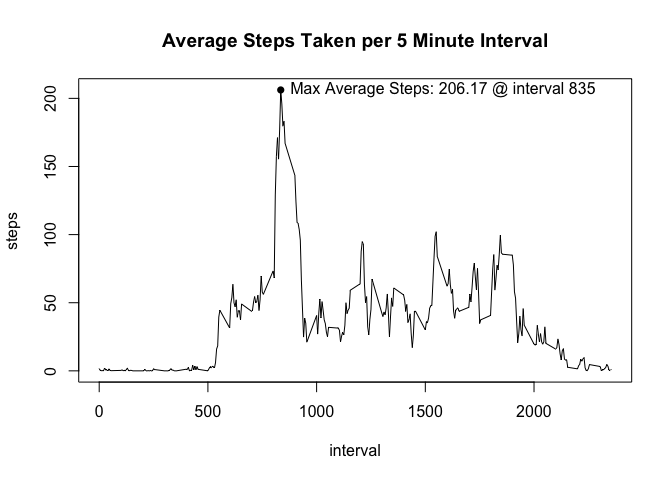
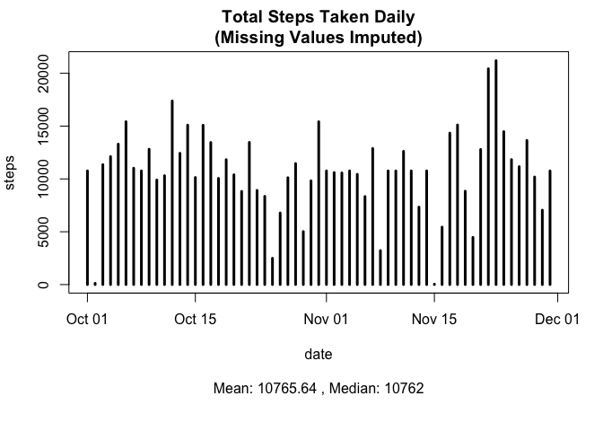
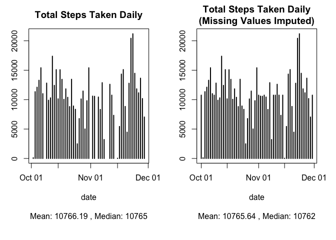
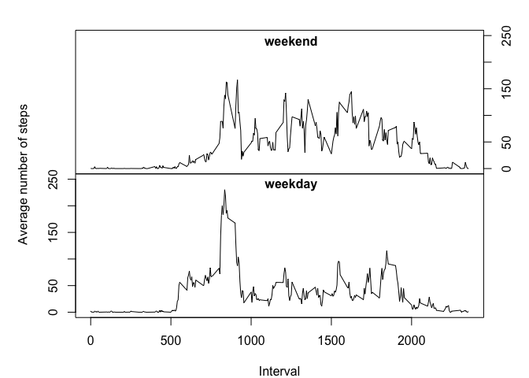

# Reproducible Data Week 2 Project Report
Carl Lee McKinney

This report is a project for week 2 of the Reproducible Data class on Coursera. It is an exercise in literate programming written in R Markdown that analyzes data from the personal activity monitoring device of an anonymous individual.

The data reports number of steps taken in 5-minute intervals daily over a 2 month period. There are 3 variables - 'steps', 'date', and 'interval' - and 17,568 observations.

First, we download and unzip the data into a new local directory called 'activity', load it into an R dataframe, and convert the class of variable 'date' from factor to date:


```r
## Create and set directory for this project
if(!file.exists("./activity")){
    dir.create("./activity")
    }
setwd("./activity")

## Download dataset and unzip
fileUrl<-"https://d396qusza40orc.cloudfront.net/repdata%2Fdata%2Factivity.zip"
download.file(fileUrl,destfile="./activity.zip",method="curl")
unzip("./activity.zip")

## Read data into a data frame and convert 'date' to class date
activity<-read.csv("./activity.csv",header=TRUE)
activity$date<-as.Date(as.character(activity$date,"%m/%d/%y"))
```

Then we calculate the total, mean, and median number of steps taken daily. We'll use the dplyr package to calculate total steps taken each day:


```r
## Load dplyr library
library(dplyr)

## Calculate total, mean, and median steps taken per day
stepsPerDay<-activity%>%filter(!is.na(steps))%>%group_by(date)%>%summarize(totalSteps=sum(steps))
meanStepsPerDay<-round(mean(stepsPerDay$totalSteps),2)
medianStepsPerDay<-median(stepsPerDay$totalSteps)
```

Let's look a histogram of total steps taken daily, and also the mean and media of steps per day:


```r
## Plot total, mean, and median of steps taken daily
par(mar=c(8,4,3,2))
with(stepsPerDay,plot(date,totalSteps,type="h",lwd=3,ylab="steps",main="Total Steps Taken Daily"))
  note<-paste("Mean:",meanStepsPerDay,", Median:",medianStepsPerDay)
    mtext(note,1,5)
```

<!-- -->

Next we look for activity patterns by plotting a time series of steps taken in 5 minute intervals averaged across all days. We also note the maximum average steps and the interval at which this occurred.


```r
## Aggregate the mean of steps taken in each interval of every day and plot
meanint<-aggregate(steps~interval,data=activity,mean)
plot(meanint,type="l",main="Average Steps Taken per 5 Minute Interval")

## Annotate the plot with point and text at max
maxnote<-paste("Max Average Steps:",round(max(meanint$steps),2),"@ interval",meanint[which.max(meanint$steps),1])
points(meanint[which.max(meanint$steps),1],max(meanint$steps),pch=16)
text(meanint[which.max(meanint$steps),1],max(meanint$steps),maxnote,pos=4)
```

<!-- -->

Now, there are a number of missing values in the data... **2304** to be exact. What happens if we impute these values with the average steps taken in that interval across all days? Again we use the dplyr package:


```r
## Replace NAs with average 'steps' by 'interval' and store in new data frame
activityImputed<-activity%>%group_by(interval)%>%mutate(steps=ifelse(is.na(steps),round(mean(steps,na.rm=TRUE),0),steps))

## Calculate total, mean, and median of steps taken daily
stepsPerDayI<-activityImputed%>%filter(!is.na(steps))%>%group_by(date)%>%summarize(totalSteps=sum(steps))
meanStepsPerDayI<-round(mean(stepsPerDayI$totalSteps),2)
medianStepsPerDayI<-median(stepsPerDayI$totalSteps)

## Plot total steps taken daily
par(mar=c(8,4,3,2))
with(stepsPerDayI,plot(date,totalSteps,type="h",lwd=3,ylab="steps",main="Total Steps Taken Daily\n(Missing Values Imputed)"))
    noteI<-paste("Mean:",meanStepsPerDayI,", Median:",medianStepsPerDayI)
    mtext(noteI,1,5)
```

<!-- -->

Does this change the data noticeably? Let's compare the data with missing values to the data where missing values are imputed and see:


```r
## Format graphic device and plot comparisons side-by-side
par(mfrow=c(1,2),mar=c(8,3,3,2))
    with(stepsPerDay,plot(date,totalSteps,type="h",lwd=2,main="Total Steps Taken Daily"))
    mtext(note,1,5)
   with(stepsPerDayI,plot(date,totalSteps,type="h",lwd=2,main="Total Steps Taken Daily\n(Missing Values Imputed)"))
    mtext(noteI,1,5)
```

<!-- -->

We can see that on days for which no data was available we now have data comprised of the mean of intervals for all other days in the dataset, but that the mean and median number of steps per day has not changed significantly.

Finally, let's see if there are any differences in activity patterns for weekdays and weekends. We'll use the data with missing values imputed to create time series plots of the average number of steps taken in 5 minute intervals, averaged across all weekday days or weekend days.


```r
## Create factor variable 'wDay' with two levels 'weekday' and 'weekend'
weekend<-c("Saturday","Sunday")
activityImputed$wDay<-factor((weekdays(activityImputed$date)%in%weekend),levels=c(FALSE,TRUE),labels=c("weekday","weekend"))

## Aggregate mean of steps taken by interval everyday for weekend and weekday and plot
meanIntWend<-aggregate(steps~interval,data=subset(activityImputed,wDay=="weekend"),mean)
meanIntWday<-aggregate(steps~interval,data=subset(activityImputed,wDay=="weekday"),mean)
par(mfrow=c(2,1),mar=c(0,3,0,3),oma=c(4,2,2,0))
    plot(meanIntWend,type="l",xlab="",ylab="",xaxt="n",yaxt="n",ylim=c(0,250))
    axis(4)
    text(1250,240,"weekend",font=2)
    plot(meanIntWday,type="l",xlab="",ylab="",ylim=c(0,250))
    text(1250,240,"weekday",font=2)
    mtext("Average number of steps",2,0,outer=TRUE)
    mtext("Interval",1,3,outer=TRUE)
```

<!-- -->

We see very different patterns on weekdays and weekends! Maybe something to explore further... but for now, we are done!
